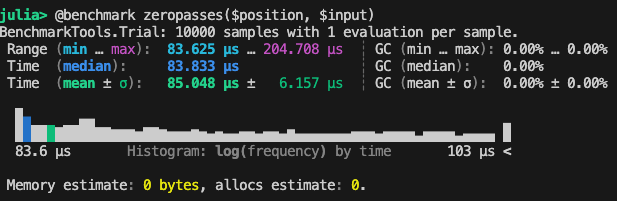

# AOC2025.jl

## Day 1
Run `julia -e 'include("1/day1.jl"); println(main("day1.txt"))'` in your terminal. This will print a tuple of the form (solution_part_1, solution_part_2).

### Benchmarking
The solutions of day 1 can be benchmarked by executing the following code in the Julia REPL (run in the root of the repo, update the specific source file and input):
```julia
using Pkg
Pkg.activate(".")
using BenchmarkTools

include("./1/day1_optimized.jl")

input = parseinput(read_input_file(input_file_path("day1__part3.txt")))
position = Position(50)
@benchmark zeropasses($position, $input)
```

For `day1.jl` and the AOC given **standard** input this gives us the following results:


For the extra large input `day1__part3.txt` this does not finish within several seconds.

The optimized version in `day1_optimized.jl` does finish on the `day1__part3.txt` with the following run times:
